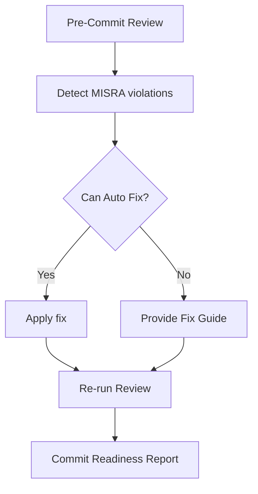

# CodeSonar Assistant

CodeSonar Assistant is a project-generic AI-powered GitHub Copilot agent for CodeSonar analysis and tracker management. It supports both C and C++ CodeSonar projects and can run in two modes:

- Offline mode using an exported CodeSonar CSV or an existing tracker
- Live mode by connecting to a CodeSonar server through configurable `.env` settings

Point it at your own project and it will download the latest report, update the tracker, generate dashboards, preserve assignments, auto-fix safe source patterns, and answer natural language queries about CodeSonar findings.

When used as a reusable team assistant, it prioritizes these workflows in order:

1. HB_PRIO_1 / HB_PRIO_2 filtering
2. Root cause explanation
3. Suggested fix with code example
4. MISRA rule mapping
5. CWE mapping
6. CERT-C mapping
7. AUTOSAR mapping for C++ projects only
8. Pre-commit code review for new changes
9. Automatic summary report generation

## Key Features

### Tracker Management
- Download the latest CodeSonar report
- Filter findings to **HB_PRIO_1** and **HB_PRIO_2**
- Synchronize with the existing Master Tracker
- Preserve Owner, Reviewer, Status, ETA, and Review information
- Automatically assign new findings when owner/reviewer pools are configured
- Generate updated Master Tracker, timestamped snapshots, and tracker history

### Dashboard & Analytics
- Dashboard summary
- Project Health analysis
- Trend Analysis (compare tracker snapshots)
- Hotspot Analysis
- Top Files
- Top Issue Classes
- Owner Workload
- Owner Progress

### Issue Analysis
- Recommend Next Issue
- Issue Details
- Explain Issue
- Similar Issues
- Search by file, class, owner, or priority

### Fix Guidance
Provides fix guidance for CodeSonar findings, including:

- Class-level Fix Guide
- Issue-level Fix Guide
- Batch Fix Guide
- Auto-Fix for safe mechanical edits
- Root cause explanation
- Suggested fix with code example
- MISRA rule mapping
- CWE mapping
- CERT-C mapping
- AUTOSAR mapping for C++ projects only
- Common causes
- Risk explanation
- Recommended remediation
- High-impact procedures/files to prioritize

### Review Engine
The assistant uses a shared Review Engine for both Pre-Commit Review and Gerrit Patchset Review.

Review source files before commit using a language-aware checker pipeline:

```mermaid
flowchart TD
    A[Pre-Commit Review] --> B[Language Detection (.c / .cpp)]
    B --> C[MISRA C / MISRA C++ Analysis]
    B --> D[CodeSonar Pattern Analysis]
    B --> E[Dangerous API Analysis]
    B --> F[Memory Safety Analysis]
    B --> G[Custom Project Rules]
    C --> H[Commit Readiness Report]
    D --> H
    E --> H
    F --> H
    G --> H
```

Returns grouped findings with line, severity, message, recommendation, summary counts, and commit readiness.

### Automatic Summary Reports
The assistant can generate concise summary reports for teams that emphasize:

- Total issues and high-priority filters
- Root cause summary
- Suggested remediation summary
- Standards mapping summary when available
- Files and classes that carry the highest impact

### Gerrit Patchset Review
The assistant performs an automated review of a Gerrit patchset by:

- Fetching the modified files from the patchset
- Running the Review Engine on each file
- Detecting:
    - MISRA violations (current supported rule set)
    - Dangerous API usage
    - CodeSonar-mapped patterns
    - Memory safety issues
- Aggregating findings across the patchset
- Generating an overall Commit Readiness Report
- Posting an appropriate Gerrit verification vote:
    - Verified +1 — no blocking findings
    - Verified -1 — blocking findings detected

The Gerrit Review workflow uses the same analysis engine as the Pre-Commit Review. Instead of reviewing a single local file, it automatically retrieves all modified files from the Gerrit patchset, analyzes them using the configured checkers, generates a consolidated review report, determines commit readiness, and posts the appropriate Gerrit verification vote.

### Auto-Fix
Auto Fix automatically repairs supported safe mechanical violations.

Workflow:



Supported auto-fixable categories:
- Safe API replacements
- Missing null checks in simple patterns
- `strcpy` -> safer alternative
- `sprintf` -> `snprintf`
- Simple initialization fixes
- Missing braces when implemented
- Redundant parentheses when implemented

Manual Fix Required categories:
- Essential type model violations
- Inappropriate assignment type
- Cast removes const
- Pointer conversions
- Control-flow restructuring
- Side effects in expressions
- Dynamic memory policy decisions
- Architecture/design issues

The assistant detects MISRA violations, automatically repairs supported safe mechanical violations, provides detailed fix guidance for the remaining issues, and re-runs the review to produce an updated Commit Readiness Report.

## Folder Structure

```text
codesonar-assistant/
├── scripts/         # Backend implementation
├── docs/            # User guide & architecture
├── data/            # Runtime CSV snapshots
├── input/           # Sample input files
├── output/          # Generated trackers & dashboards
├── examples/        # Example queries and outputs
├── README.md
├── INSTALL.md
├── requirements.txt
└── .env.example
```

Workspace-level agent definition is stored in the top-level repo at `agents/codesonar-assistant.md`.

## Quick Start

1. Clone the repository.

```bash
git clone <repository-url>
cd codesonar-assistant
```

2. Create a virtual environment.

```bash
python3 -m venv .venv
source .venv/bin/activate
```

3. Install dependencies.

```bash
pip install -r requirements.txt
```

4. Configure environment variables for your project.

```bash
cp .env.example .env
```

Set `CODESONAR_REPORT_URL`, `CODESONAR_USERNAME`, and `CODESONAR_PASSWORD` (or the supported token/cookie values) in `.env` for live mode. For offline mode, provide an exported CSV or existing tracker as the input.

5. Run the assistant.

```bash
python3 scripts/codesonar_assistant.py \
    --input data/codesonar.csv \
    --query "Dashboard"
```

After the tracker workflow has run successfully, you can also query the generated tracker directly:

```bash
python3 scripts/codesonar_assistant.py \
    --input output/Master_Tracker.xlsx \
    --query "Trend Analysis"
```

## Example Queries

### Dashboard & Project

- Dashboard
- Project Health
- Trend Analysis
- Hotspot Analysis
- Project Summary

### Tracker

- Update Tracker
- Owner Workload for a
- Owner Progress for b

### Recommendations

- Recommend Next Issue for a
- Recommend Owner
- Similar Issues 6253372

### Issue Details

- Issue 6253372
- Explain Issue 6253372
- Show issues in <file>
- Show HB_PRIO_1 issues

### Fix Guidance

- How to fix Inappropriate Assignment Type
- How to fix Use After Free
- How to fix Use of strcpy
- Fix Guide 1201340.7557926828
- Batch Fix Guide
- Auto Fix <source file>
- Where should I focus for biggest impact?
- Show root cause for issue 1201340.7557926828
- Show suggested fix with code example
- Show CWE and CERT-C mapping for Use After Free

### Pre-Commit Review

- review <source file>
- pre-commit review <source file>
- check my code <source file>
- commit readiness <source file>

### Gerrit / Auto-Fix

- auto fix <source file>
- Gerrit patchset review <gerrit link>
- Gerrit gate patchset-created <gerrit link>

Paste a Gerrit URL to review that patchset and gate it with CodeSonar findings.

## Output Files

The assistant automatically generates:

- Master_Tracker.xlsx (two sheets: Summary + Details)
- Tracker_History.xlsx
- Timestamped tracker snapshots (same two-sheet structure)

## Benefits

- Eliminates repetitive manual tracker updates
- Preserves assignment history across daily reports
- Provides instant project health and dashboard metrics
- Helps prioritize high-risk findings
- Explains CodeSonar findings with recommended fixes
- Applies safe auto-fixes for common patterns
- Can block Gerrit patchsets with Verified -1 when HIGH severity findings remain
- Enables natural language interaction with CodeSonar data through GitHub Copilot

## Future Enhancements

- Expand MISRA C rule coverage
- Add MISRA C++ / AUTOSAR C++14 checks
- More advanced memory-safety rules
- Additional CodeSonar pattern detection
- Custom project-specific coding guidelines

## License

Internal project intended for CodeSonar automation and analysis.