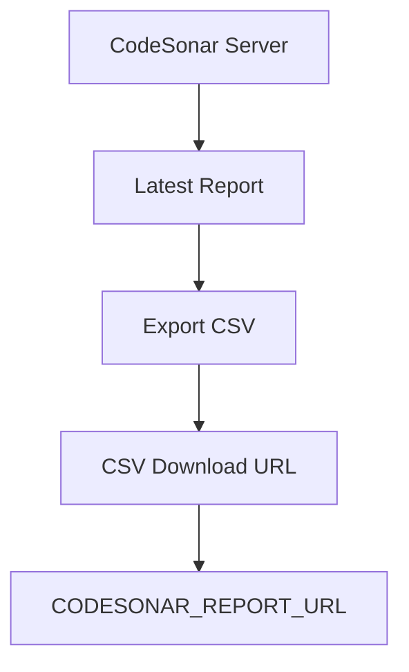
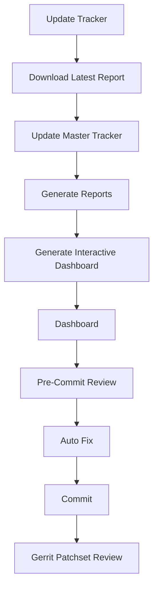
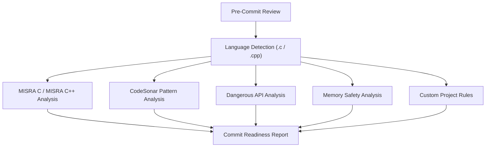

# CodeSonar Assistant

CodeSonar Assistant is a project-generic AI-powered GitHub Copilot agent for CodeSonar analysis and tracker management. It supports both C and C++ CodeSonar projects and can run in two modes:

- Offline mode using an exported CodeSonar CSV or an existing tracker
- Live mode by connecting to a CodeSonar server through configurable `.env` settings

Point it at your own project and it will download the latest report, update the tracker, generate dashboards, preserve assignments, auto-fix safe source patterns, and answer natural language queries about CodeSonar findings.

## 🚀 What's New in v2.0

- Interactive ASPICE-style Dashboard
- Executive Project Health Summary
- Project Health KPIs
- Priority Distribution Charts
- Issue Class Distribution
- Top Files Analysis
- Owner Workload Dashboard
- Hotspot Analysis
- Trend Analysis
- Search & Filter Findings
- Finding Details View
- Dark / Light Theme
- CSV Export
- Print Dashboard
- Dashboard automatically generated after Update Tracker

## Download The Whole Project

If you want to use the assistant exactly as shipped here, clone the whole repository and open it as a VS Code workspace:

```bash
git clone <repository-url>
cd codesonar-assistant
code .
```

This gives you the full assistant, the docs, the sample data, and the workspace agent definition in `agents/codesonar-assistant.md`.

## Set Up This Agent In A Workspace

The workspace agent is already included in this repo at [agents/codesonar-assistant.md](agents/codesonar-assistant.md).

To use it in another workspace:

1. Create an `agents/` folder in the target workspace if it does not exist.
2. Copy `agents/codesonar-assistant.md` into that folder.
3. Open the workspace in VS Code.
4. Reload VS Code or reopen the workspace so the agent definition is picked up.

If you are cloning this repository to use the assistant, no extra agent setup is needed beyond opening the workspace.

## Quick Start Guide

Choose one of the following modes depending on your environment.

### Option 1 - Online Mode (Recommended)

Use this mode if you have access to a CodeSonar server.

1. Clone the repository.
2. Copy `.env.example` to `.env`.
3. Set these values in `.env`:

```bash
CODESONAR_REPORT_URL=
CODESONAR_USERNAME=
CODESONAR_PASSWORD=
```

`CODESONAR_REPORT_URL` is not the CodeSonar web homepage. It must point to the CodeSonar report or CSV download endpoint that the assistant uses to fetch the latest analysis results automatically.

Think of the flow like this:



Every time you run `Update Tracker` or `Dashboard`, the assistant downloads the latest CSV from that URL.

4. Run `Update Tracker`.

This automatically:

- downloads the latest CodeSonar report
- filters `HB_PRIO_1` and `HB_PRIO_2`
- synchronizes the tracker
- preserves assignments
- generates dashboards

5. Start asking questions.

Example:

- `Dashboard`

### Option 2 - Offline Mode

Use this mode if you do not have access to the CodeSonar server.

1. Export a CodeSonar CSV manually.
2. Place it under `data/codesonar.csv`.
3. Run `Update Tracker`.

The assistant will build the tracker from the local CSV instead of downloading one.

No `.env` configuration is required for offline mode.

## Typical Workflow

A normal developer workflow looks like this:



## Common Prompts

### Tracker

- `Update Tracker`
- `Dashboard`
- `Project Health`
- `Trend Analysis`
- `Project Summary`
- `Hotspot Analysis`

### Owner

- `Owner Workload`
- `Owner Progress`
- `Recommend Owner`

### Issue Investigation

- `Issue Details <Issue ID>`
- `Explain Issue <Issue ID>`
- `Similar Issues <Issue ID>`
- `Search Issues`
- `Recommend Next Issue`

### Fix Guidance

- `How to fix <Issue Class>`
- `Fix Guide <Issue ID>`
- `Batch Fix Guide`
- `Where should I focus for biggest impact?`

Examples:

- `How to fix Use After Free`
- `How to fix Buffer Overrun`
- `Fix Guide 6253372`

### Auto Fix

- `Auto Fix <source file>`

Example:

- `Auto Fix file_name.c`

### Pre-Commit Review

Use this before committing your code.

- `Review <source file>`
- `Pre-Commit Review <source file>`
- `Check my code <source file>`
- `Commit Readiness <source file>`

Example:

- `Pre-Commit Review bsmd.c`

### Gerrit Review

Use this to review an entire Gerrit patchset.

- `Gerrit review <gerrit patchset link>`

Example:

- `Gerrit review https://gerrit.company.com/c/project/+/480698`

The assistant will:

- download the modified files
- review every file
- identify blocking findings
- generate commit readiness
- post `Verified +1` or `Verified -1`

### Not Sure What to Use?

If you are not sure where to start, use:

- `Update Tracker` for live or offline data refresh
- `Dashboard` for the project overview
- `Fix Guide <issue or class>` for remediation help
- `Auto Fix <source file>` for safe mechanical changes

When used as a reusable team assistant, it prioritizes these workflows in order:

When used as a reusable team assistant, it prioritizes these workflows in order:

1. HB_PRIO_1 / HB_PRIO_2 filtering
2. Root cause explanation
3. Suggested fix with code example
4. MISRA rule mapping
5. CWE mapping
6. CERT-C mapping
7. AUTOSAR mapping for C++ projects only
8. Pre-commit code review for new changes
9. Automatic summary report generation

## Key Features

### Tracker Management
- Download the latest CodeSonar report
- Filter findings to **HB_PRIO_1** and **HB_PRIO_2**
- Synchronize with the existing Master Tracker
- Preserve Owner, Reviewer, Status, ETA, and Review information
- Automatically assign new findings when owner/reviewer pools are configured
- Generate updated Master Tracker, timestamped snapshots, and tracker history

### Dashboard & Analytics
- `Dashboard` opens the Interactive Dashboard generated at `output/dashboard/index.html` — it does not re-download CodeSonar data; run `Update Tracker` first to refresh it.
- Dashboard summary
- Project Health analysis
- Trend Analysis (compare tracker snapshots)
- Hotspot Analysis
- Top Files
- Top Issue Classes
- Owner Workload
- Owner Progress

### Issue Analysis
- Recommend Next Issue
- Issue Details
- Explain Issue
- Similar Issues
- Search by file, class, owner, or priority

### Fix Guidance
Provides fix guidance for CodeSonar findings, including:

- Class-level Fix Guide
- Issue-level Fix Guide
- Batch Fix Guide
- Auto-Fix for safe mechanical edits
- Root cause explanation
- Suggested fix with code example
- MISRA rule mapping
- CWE mapping
- CERT-C mapping
- AUTOSAR mapping for C++ projects only
- Common causes
- Risk explanation
- Recommended remediation
- High-impact procedures/files to prioritize

### Review Engine
The assistant uses a shared Review Engine for both Pre-Commit Review and Gerrit Patchset Review.

Review source files before commit using a language-aware checker pipeline:



Returns grouped findings with line, severity, message, recommendation, summary counts, and commit readiness.

### Automatic Summary Reports
The assistant can generate concise summary reports for teams that emphasize:

- Total issues and high-priority filters
- Root cause summary
- Suggested remediation summary
- Standards mapping summary when available
- Files and classes that carry the highest impact

### Gerrit Patchset Review
The assistant performs an automated review of a Gerrit patchset by:

- Fetching the modified files from the patchset
- Running the Review Engine on each file
- Detecting:
    - MISRA violations (current supported rule set)
    - Dangerous API usage
    - CodeSonar-mapped patterns
    - Memory safety issues
- Aggregating findings across the patchset
- Generating an overall Commit Readiness Report
- Posting an appropriate Gerrit verification vote:
    - Verified +1 — no blocking findings
    - Verified -1 — blocking findings detected

The Gerrit Review workflow uses the same analysis engine as the Pre-Commit Review. Instead of reviewing a single local file, it automatically retrieves all modified files from the Gerrit patchset, analyzes them using the configured checkers, generates a consolidated review report, determines commit readiness, and posts the appropriate Gerrit verification vote.

### Auto-Fix
Auto Fix automatically repairs supported safe mechanical violations.

Workflow:


Supported auto-fixable categories:
- Safe API replacements
- Missing null checks in simple patterns
- `strcpy` -> safer alternative
- `sprintf` -> `snprintf`
- Simple initialization fixes
- Missing braces when implemented
- Redundant parentheses when implemented

Manual Fix Required categories:
- Essential type model violations
- Inappropriate assignment type
- Cast removes const
- Pointer conversions
- Control-flow restructuring
- Side effects in expressions
- Dynamic memory policy decisions
- Architecture/design issues

The assistant detects MISRA violations, automatically repairs supported safe mechanical violations, provides detailed fix guidance for the remaining issues, and re-runs the review to produce an updated Commit Readiness Report.

## Interactive Dashboard

CodeSonar Assistant v2.0 introduces a fully static, ASPICE-style Interactive Dashboard that is automatically generated after every `Update Tracker` run. It requires no server — just open `output/dashboard/index.html` in a browser.

The dashboard provides:

- Executive Summary
- Project Health
- Quality KPIs
- Priority Distribution
- Issue Class Distribution
- Top Files
- Owner Dashboard
- Hotspot Analysis
- Trend Analysis
- Search & Filters
- Detailed Finding View
- Dark/Light Theme
- CSV Export
- Print Support

## Dashboard Preview


## Folder Structure

```text
codesonar-assistant/
├── scripts/         # Backend implementation
├── docs/            # User guide & architecture
├── data/            # Runtime CSV snapshots
├── input/           # Sample input files
├── output/          # Generated trackers & dashboards
├── examples/        # Example queries and outputs
├── README.md
├── INSTALL.md
├── requirements.txt
└── .env.example
```

Workspace-level agent definition is stored in the top-level repo at `agents/codesonar-assistant.md`.

## Output Files

The assistant automatically generates:

- Master_Tracker.xlsx (two sheets: Summary + Details)
- Tracker_History.xlsx
- Timestamped tracker snapshots (same two-sheet structure)

Every `Update Tracker` run also (re)generates the static Interactive Dashboard:

```text
output/
└── dashboard/
    ├── index.html
    ├── dashboard_data.json
    ├── css/
    ├── js/
    └── assets/
```

## Benefits

- Eliminates repetitive manual tracker updates
- Preserves assignment history across daily reports
- Provides instant project health and dashboard metrics
- Helps prioritize high-risk findings
- Explains CodeSonar findings with recommended fixes
- Applies safe auto-fixes for common patterns
- Can block Gerrit patchsets with Verified -1 when HIGH severity findings remain
- Enables natural language interaction with CodeSonar data through GitHub Copilot
- Interactive engineering dashboard
- ASPICE-style project health reporting
- Faster hotspot identification
- Visual owner workload tracking
- Easier release readiness reviews
- One-click dashboard generation

## Future Enhancements

- Expand MISRA C rule coverage
- Add MISRA C++ / AUTOSAR C++14 checks
- More advanced memory-safety rules
- Additional CodeSonar pattern detection
- Custom project-specific coding guidelines
- Scheduled email reports
- Teams/Slack notifications
- Multi-project dashboard
- Live dashboard refresh
- AI-powered engineering insights
- Release readiness prediction
- Historical analytics

## Version

Current Version: v2.0

Major Features:
- Tracker Management
- Interactive Dashboard
- Project Health
- Trend Analysis
- Hotspot Analysis
- Pre-Commit Review
- Gerrit Review
- Auto Fix
- Fix Guidance
- Summary Reports

## License

Internal project intended for CodeSonar automation and analysis.
