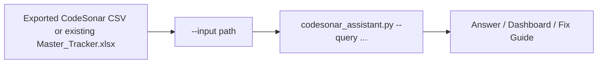
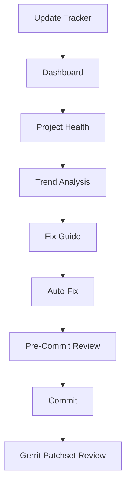
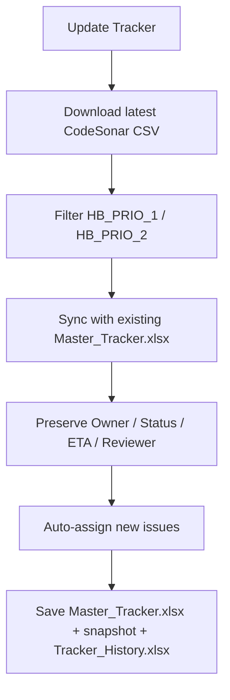
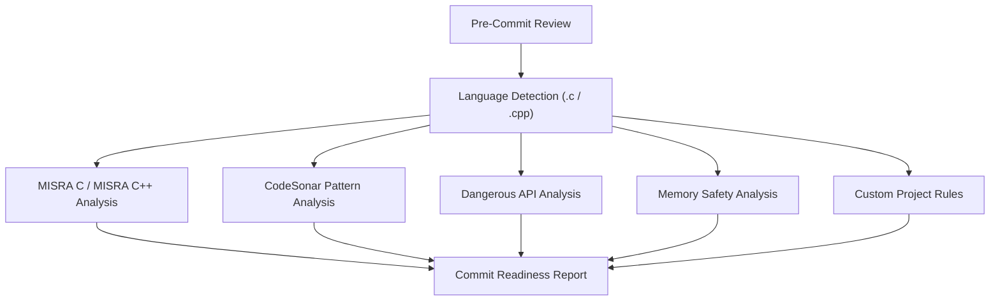
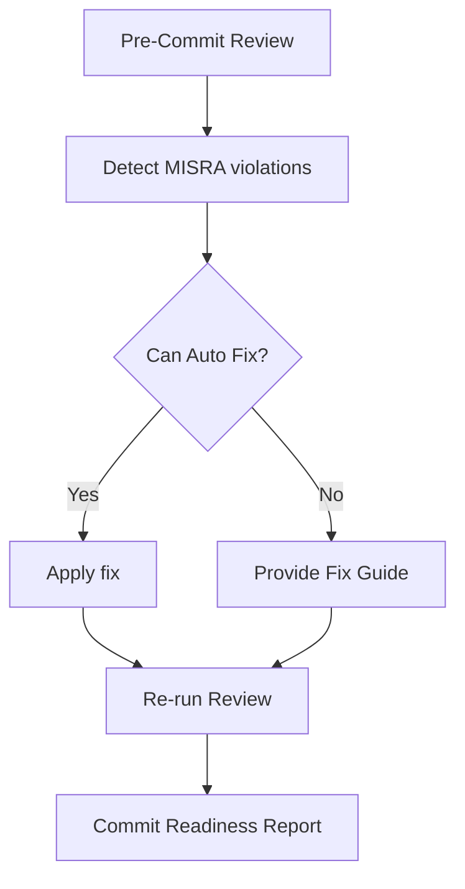

# CodeSonar Assistant

CodeSonar Assistant is a project-generic AI-powered GitHub Copilot agent for CodeSonar analysis and tracker management. It supports both C and C++ CodeSonar projects and can run in two modes:

- Offline mode using an exported CodeSonar CSV or an existing tracker
- Live mode by connecting to a CodeSonar server through configurable `.env` settings

Point it at your own project and it will download the latest report, update the tracker, generate dashboards, preserve assignments, auto-fix safe source patterns, and answer natural language queries about CodeSonar findings.

When used as a reusable team assistant, it prioritizes these workflows in order:

1. HB_PRIO_1 / HB_PRIO_2 filtering
2. Root cause explanation
3. Suggested fix with code example
4. MISRA rule mapping
5. CWE mapping
6. CERT-C mapping
7. AUTOSAR mapping for C++ projects only
8. Pre-commit code review for new changes
9. Automatic summary report generation

## How It Works

**Offline mode** — analyze an exported CSV or an existing tracker, no server connection required:



**Online / live mode** — connect to a CodeSonar server via `.env` and refresh the tracker automatically:



## Legacy Code vs New Code

The assistant supports two complementary use cases:

**Legacy code (existing backlog of findings)**
- Run `Update Tracker` to pull the latest CodeSonar report and sync it into `Master_Tracker.xlsx`
- Use `Dashboard`, `Project Health`, `Hotspot Analysis`, and `Batch Fix Guide` to triage the backlog and prioritize high-impact files
- Owner, Reviewer, Status, and ETA are preserved across runs, so existing assignments are never lost

**New code (active development / code under review)**
- Run `review <file>` or `pre-commit review <file>` before committing to catch MISRA, dangerous API, and memory-safety issues locally
- Run `Auto Fix <file>` to apply safe mechanical fixes automatically
- Use `Gerrit patchset review <link>` to gate a patchset with a `Verified +1/-1` vote, independent of the tracker workflow

## Key Features

### Tracker Management
- Download the latest CodeSonar report
- Filter findings to **HB_PRIO_1** and **HB_PRIO_2**
- Synchronize with the existing Master Tracker
- Preserve Owner, Reviewer, Status, ETA, and Review information
- Automatically assign new findings when owner/reviewer pools are configured
- Generate updated Master Tracker, timestamped snapshots, and tracker history

**What `Update Tracker` actually does, step by step:**

1. Downloads the latest CodeSonar CSV from `CODESONAR_REPORT_URL` (tries the `.csv` variant of an `.html` URL, then follows analysis-index links if needed)
2. Filters findings down to `HB_PRIO_1` and `HB_PRIO_2`
3. Reads the existing `Master_Tracker.xlsx` (if present) and merges the new report by issue `id`
4. For existing issues, preserves `Owner`, `Status`, `ETA`, `Reviewer`, `ReviewStatus`, `ReviewETA`
5. For new issues, sets `Owner`/`Reviewer` to `Unassigned` and `Status`/`ReviewStatus` to `Pending`
6. Auto-assigns new issues round-robin across `CODESONAR_OWNERS`/`CODESONAR_REVIEWERS` if configured
7. Writes `output/Master_Tracker.xlsx`, a timestamped snapshot `output/Master_Tracker_YYYYMMDD.xlsx`, and appends a row to `output/Tracker_History.xlsx`
8. Prints a summary of original findings, HB_PRIO_1/HB_PRIO_2 counts, new/resolved/reopened issues, and assignment counts



### Dashboard & Analytics
- Dashboard summary
- Project Health analysis
- Trend Analysis (compare tracker snapshots)
- Hotspot Analysis
- Top Files
- Top Issue Classes
- Owner Workload
- Owner Progress
- Automatic summary report generation
- The static dashboard output is self-contained so `output/dashboard/index.html` can be opened directly from disk.
- Owner and reviewer pools can be configured in `.env` with `CODESONAR_OWNERS` and `CODESONAR_REVIEWERS`; the dashboard and tracker workflow both honor those values.
- Configured owners now appear in the dashboard owner list and owner filter even before any issues are assigned to them.

### Issue Analysis
- Recommend Next Issue
- Issue Details
- Explain Issue
- Similar Issues
- Search by file, class, owner, or priority

### Fix Guidance
Provides fix guidance for CodeSonar findings, including:

- Class-level Fix Guide
- Issue-level Fix Guide
- Batch Fix Guide
- Auto-Fix for safe mechanical edits
- Root cause explanation
- Suggested fix with code example
- MISRA rule mapping
- CWE mapping
- CERT-C mapping
- AUTOSAR mapping for C++ projects only
- Common causes
- Risk explanation
- Recommended remediation
- High-impact procedures/files to prioritize

### Review Engine
The assistant uses a shared Review Engine for both Pre-Commit Review and Gerrit Patchset Review.

Review source files before commit using a language-aware checker pipeline:



Returns grouped findings with line, severity, message, recommendation, summary counts, and commit readiness.

### Gerrit Patchset Review
The assistant performs an automated review of a Gerrit patchset by:

- Fetching the modified files from the patchset
- Running the Review Engine on each file
- Detecting:
    - MISRA violations (current supported rule set)
    - Dangerous API usage
    - CodeSonar-mapped patterns
    - Memory safety issues
- Aggregating findings across the patchset
- Generating an overall Commit Readiness Report
- Posting an appropriate Gerrit verification vote:
    - Verified +1 — no blocking findings
    - Verified -1 — blocking findings detected

The Gerrit Review workflow uses the same analysis engine as the Pre-Commit Review. Instead of reviewing a single local file, it automatically retrieves all modified files from the Gerrit patchset, analyzes them using the configured checkers, generates a consolidated review report, determines commit readiness, and posts the appropriate Gerrit verification vote.

### Auto-Fix
Auto Fix automatically repairs supported safe mechanical violations.

Workflow:



Supported auto-fixable categories:
- Safe API replacements
- Missing null checks in simple patterns
- `strcpy` -> safer alternative
- `sprintf` -> `snprintf`
- Simple initialization fixes
- Missing braces when implemented
- Redundant parentheses when implemented

Manual Fix Required categories:
- Essential type model violations
- Inappropriate assignment type
- Cast removes const
- Pointer conversions
- Control-flow restructuring
- Side effects in expressions
- Dynamic memory policy decisions
- Architecture/design issues

The assistant detects MISRA violations, automatically repairs supported safe mechanical violations, provides detailed fix guidance for the remaining issues, and re-runs the review to produce an updated Commit Readiness Report.

## Folder Structure

```text
codesonar-assistant/
├── scripts/         # Backend implementation
├── docs/            # User guide & architecture
├── data/            # Runtime CSV snapshots
├── input/           # Sample input files
├── output/          # Generated trackers & dashboards
├── examples/        # Example queries and outputs
├── README.md
├── INSTALL.md
├── requirements.txt
└── .env.example
```

Workspace-level agent definition is stored in the top-level repo at `agents/codesonar-assistant.md`.

## Environment Setup

`.env` holds your CodeSonar and Gerrit connection settings. It is created automatically from `.env.example` the first time you run any assistant script (`daily_workflow.py`, `codesonar_assistant.py`, `gerrit_hook.py`, or `gerrit_event_listener.py`) — no manual copy step required, and an existing `.env` is never overwritten.

The most important value is `CODESONAR_REPORT_URL`:

- It must point to the CodeSonar **report or CSV export endpoint** for your project/analysis, not the sign-in page.
- If you provide the project/analysis `.html` URL, the workflow also tries the equivalent `.csv` URL automatically.
- Live-mode downloads require this URL plus `CODESONAR_USERNAME`/`CODESONAR_PASSWORD`, or a `CODESONAR_COOKIE`/`CODESONAR_TOKEN`.

For offline mode, skip `.env` entirely and point `--input` at an exported CSV or existing tracker. See [INSTALL.md](INSTALL.md) for the full list of `.env` variables (owner/reviewer pools, Gerrit settings, etc.).

## Quick Start

```bash
git clone <repository-url>
cd codesonar-assistant
python3 -m venv .venv && source .venv/bin/activate
pip install -r requirements.txt
```

```bash
python3 scripts/codesonar_assistant.py \
    --input data/codesonar.csv \
    --query "Dashboard"
```

After the tracker workflow has run successfully, you can also query the generated tracker directly:

```bash
python3 scripts/codesonar_assistant.py \
    --input output/Master_Tracker.xlsx \
    --query "Trend Analysis"
```

For full step-by-step installation (virtual environment, dependencies, agent file, Gerrit setup), see [INSTALL.md](INSTALL.md).

## First Commands to Try

- `Update Tracker` — download the latest report and refresh `Master_Tracker.xlsx`
- `Dashboard` — overall project metrics
- `Project Health` — risk concentration and status
- `review <source file>` — local pre-commit review
- `Fix Guide <class or issue>` — understand and fix a specific finding

## Example Queries

### Dashboard & Project

- Dashboard
- Project Health
- Trend Analysis
- Hotspot Analysis
- Project Summary

### Tracker

- Update Tracker
- Owner Workload for a
- Owner Progress for b

### Recommendations

- Recommend Next Issue for a
- Recommend Owner
- Similar Issues 6253372

### Issue Details

- Issue 6253372
- Explain Issue 6253372
- Show issues in <file>
- Show HB_PRIO_1 issues

### Fix Guidance

- How to fix Inappropriate Assignment Type
- How to fix Use After Free
- How to fix Use of strcpy
- Fix Guide 1201340.7557926828
- Batch Fix Guide
- Auto Fix <source file>
- Where should I focus for biggest impact?
- Show root cause for issue 1201340.7557926828
- Show suggested fix with code example
- Show CWE and CERT-C mapping for Use After Free

### Pre-Commit Review

- review <source file>
- pre-commit review <source file>
- check my code <source file>
- commit readiness <source file>

### Gerrit / Auto-Fix

- auto fix <source file>
- Gerrit patchset review <gerrit link>
- Gerrit gate patchset-created <gerrit link>

Paste a Gerrit URL to review that patchset and gate it with CodeSonar findings.

## Generated Excel Outputs

Every `Update Tracker` run writes:

- **`output/Master_Tracker.xlsx`** — two sheets:
  - `Summary`: Overall Metrics (Total Issues, Pending, Done, HB_PRIO_1, HB_PRIO_2, Owners, Reviewers), Top Files, Issue Class Distribution, Owner Workload, Reviewer Workload
  - `Details`: one row per finding — `score`, `id`, `class`, `significance`, `file`, `line number`, `procedure`, `priority`, `state`, `finding`, `owner`, `reviewer`, `url`, plus the tracker columns `Owner`, `Status`, `ETA`, `Reviewer`, `ReviewStatus`, `ReviewETA`
- **`output/Master_Tracker_YYYYMMDD.xlsx`** — a timestamped snapshot with the same two-sheet structure, kept for historical comparison
- **`output/Tracker_History.xlsx`** — one row per day (`Date`, `Total`, `HB1`, `HB2`, `New`, `Resolved`), used by `Trend Analysis`

## Benefits

- Eliminates repetitive manual tracker updates
- Preserves assignment history across daily reports
- Provides instant project health and dashboard metrics
- Helps prioritize high-risk findings
- Explains CodeSonar findings with recommended fixes
- Applies safe auto-fixes for common patterns
- Can block Gerrit patchsets with Verified -1 when HIGH severity findings remain
- Generates automatic summary reports that emphasize priority, root cause, fixes, and mappings
- Enables natural language interaction with CodeSonar data through GitHub Copilot

## Future Enhancements

- Expand MISRA C rule coverage
- Add MISRA C++ / AUTOSAR C++14 checks
- More advanced memory-safety rules
- Additional CodeSonar pattern detection
- Custom project-specific coding guidelines

## License

Internal project intended for CodeSonar automation and analysis.
